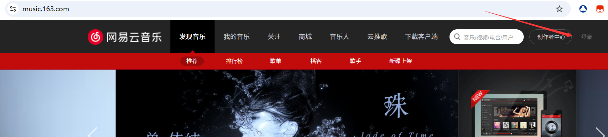

# 介绍

这是一个网易云音乐下载器。在网易云音乐中，很多歌曲听是免费的，但下载需要VIP，此程序旨在“可听”则可下，只要能够听的歌，都可以下载下来。


本程序基于Python3.8开发，使用requests库，通过对网易云音乐的JS代码进行逆向分析，实现搜索及下载功能。如果你觉得对你有帮助，请点击**Star**；如在使用过程中有问题，请在**Issue**提交。


此程序打包为exe可执行程序，没有Python环境的用户可前往**Release**下载。


Github原链接：[https://github.com/13337356453/163Music](https://github.com/13337356453/163Music)


# 使用方法

## 1.安装第三方库

在同目录下打开终端，执行此代码安装第三方库：

```shell
pip install -r requirement.txt
```

全部安装完成后进入下一步


## 2.获取Cookie

打开网易云音乐的网站：[https://music.163.com/](https://music.163.com/)，点击右上角**登录**按钮，按操作登录



登陆完成后按下**F12**进入**开发者工具**，选择**Network**


点击**刷新按钮**刷新界面，同时下方出现**请求包**。


选中请求包，查看**Cookie**，将其复制


## 3.运行程序

首先选择好你想要下载的歌曲，例如我想下载陶喆的**爱我还是他**。

此程序基于网易云的搜索功能实现，因此你需要先去搜索功能筛选。

在搜索框输入**爱我还是他**，得到的结果的第一条即为我想要的歌曲。


接下来运行程序，可以输入参数**-h**来查看参数详细

```shell
python .\Yun.py -h
```


其中，**-c**和**-k**是必选参数。

例如我要下载歌曲**爱我还是他**，下载**一首**，不使用代理，储存在当前**music**目录下。

```shell
python Yun.py -c "cookie" -k 爱我还是他
```


歌曲保存到**./music/爱我还是他-陶喆.mp3**


如果有多个关键字，则可创建一个文件，其中存储多个关键字

例如我在此创建一个名为**kw.txt**的文件，其中储存多个关键字


则可在**-k**参数中指定为文件名

```shell
python .\Yun.py -c "Ncookie" -k .\kw.txt
```


## 注意事项

如果是exe用户，请跳过第一步。

爬取可能失败，失败的歌曲多试几次。

